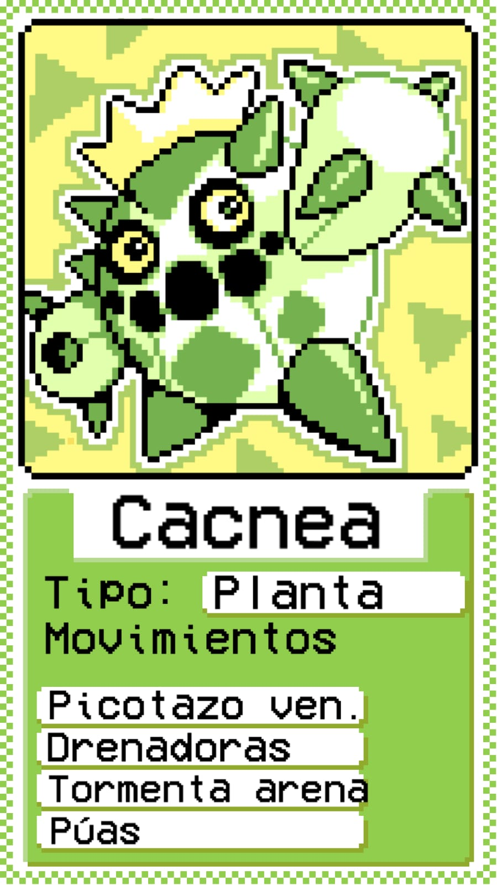
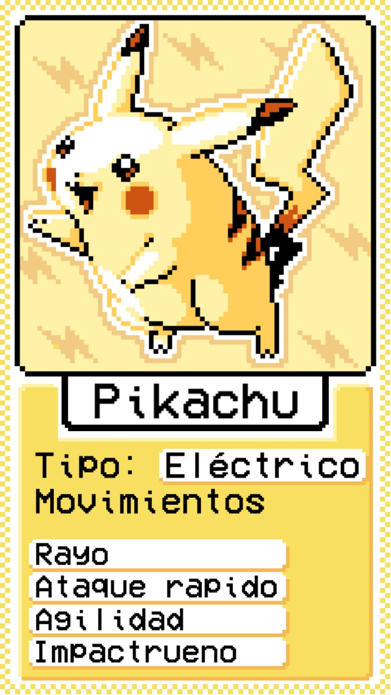
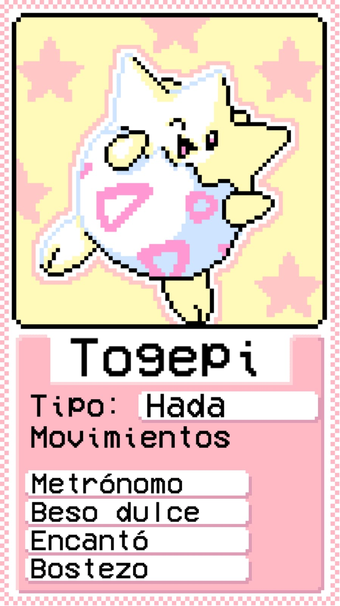
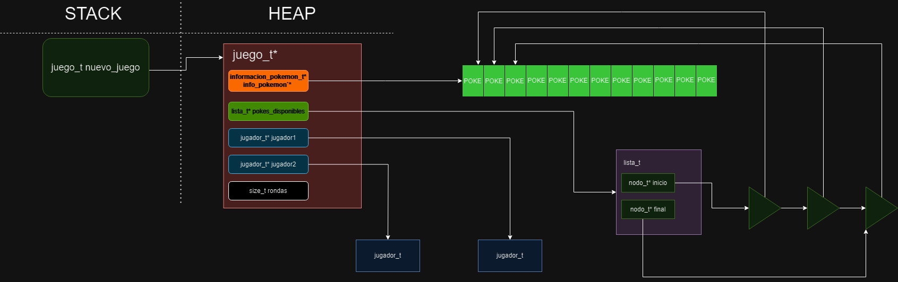
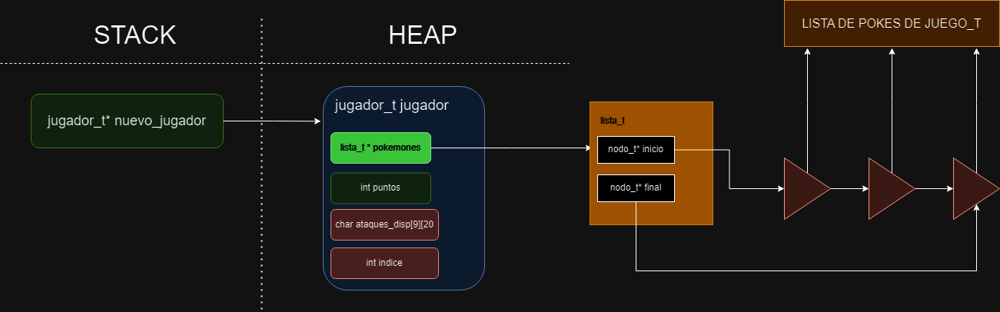
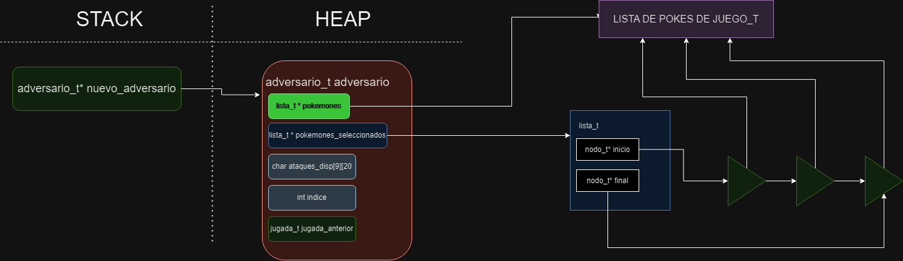

# Juego de cartas Pokemon


## Yaco Santamarina - 110974 - ysantamarina@fi.uba.ar

- Para compilar:

```bash
-std=c99 -Wall -Wconversion -Wtype-limits -pedantic -Werror -O0 -g
```

- Para ejecutar:

```bash
make
```

- Para ejecutar con valgrind:
```bash
--leak-check=full --track-origins=yes --show-reachable=yes --error-exitcode=2 --show-leak-kinds=all --trace-children=yes
```
---

### Reglas del juego
- El juego requiere de 2 jugadores. 
- Al principio del juego se le presenta a los jugadores un listado de los pokemon disponibles.
- Cada jugador selecciona 3 pokemon de los disponibles.
  - Los 3 pokemon deben ser diferentes, no se puede repetir pokemon
  - Ambos jugadores realizan su elección sin conocer la elección del otro jugador
- Una vez seleccionados los pokemon por ambos usuario, se informan las elecciones.
  - Los primeros 2 pokemon seleccionados por el usuario son pokemon propios mientras que el tercer pokemon debe ser asignado como tercer pokemon del otro jugador
  - Por ejemplo, el jugador 1 selecciona A, B y C; el jugador 2 selecciona D, E y F. El equipo final del jugador 1 está formado por A, B y F, mientras que el equipo de jugador 2 queda D, E y C.
  - Si bien cada jugador debe seleccionar 3 pokemon diferentes, es posible que en el equipo final queden pokemon duplicados (ya que el tercer pokemon es elegido secretamente por el otro jugador)
- El juego se desarrolla por rondas. Como cada jugador tiene 3 pokemon y cada pokemon tiene 3 ataques, la cantidad de rondas del juego siempre es 9.
  - En cada ronda cada jugador decide un pokemon y un ataque de ese pokemon.
  - Los pokemon seleccionados se enfrentan.
  - Se le asigna a cada jugador un puntaje que se calcula en base al poder del ataque y el tipo del ataque y del pokemon adversario.
  - Una vez utilizado un ataque de un pokemon, este no puede ser utilizado nunca mas durante el juego.
- Al finalizar el juego, gana el jugador con mas puntos.

##  Funcionamiento
Antes que todo me parece comprometedor, al ser un videojuego, y por ende lo debo tomar con cierta responsabilidad, me tome la molestia de conseguir y pensar las ideas de diseño del juego de cartas.


<div align="center">

</div>

<div align="center">

</div>

<div align="center">

</div>

## JUEGO.c ## 
El juego de pokemon esta creado en base a casi su totalidad en listas. 
Consta de una estructura juego, esta estructura guardara en su informacion los siguientes datos:

`informacion_pokemon_t* info_pokemon` = Sirve para tener conocimiento de los pokemons disponibles e una estructura_pokemon_t*

`lista_t* pokemones_disponibles;` = Esta lista estara apuntando cada uno de los pokemones existentes en cada uno de sus nodos a la info pokemon, es una funcion crucial en el TDA ya que se usara para tener conocimiento mediante una lista de los pokemons existentes. Ademas sirve para que otras estructuras tengan mejor acceso a los pokemones, sin necesidad de acceder directamente a la info_pokemon

`jugador_t* jugador1 y 2` = Estas estructuras de jugadores tambien tendran en su interior otros campos, pero por ahora nos sirve para 
poder guardar las elecciones/acciones de los jugadores durante el juego.

`size_t rondas` = esto simplemente contara las rondas restantes del juego.

<div align="center">

</div>

La parte verdaderamente interesante sera el caso de la estructura `jugador_t`, esta estructura tiene en su interior:

`lista_t* pokemones` = Esta lista sera la encargada de APUNTAR a los pokemones seleccionados por el jugador (y por el otro jugador al cambiarse). Decidi tomar una lista ya que en el acceso de datos estamos hablando de la busqueda de 3 posibles datos, por lo que todas
las operaciones de lista se reducen a casos de `O(1) < complejidad < O(3)`. Recordemos que estos pokemones son simplemente una referencia a los de la lista de juego.c, no son nuevos datos. 

`int puntos` = Son los puntos obtenidos por el jugador.

`char ataques_disponibles[9][20];` = Este vector estatico es una manera que encontre para poder tener registro de todos los ataques de los pokemones seleccionados por el usuario, se almacenaran todos los ataques de los 3 pokemones seleccionados, es decir 9 ataques.
Sirve tanto como para poder verificar que esta disponible el ataque para ser usado como para "quitarlo" y no permitir que sea usado nuevamente. Otra ventaja que logre con este metodo fue el echo de que si por algun casual el jugador llega a tener 2 pokemones iguales
tambien tendra 2 pares de ataques iguales. 

`int indice_ataques` = Este indice simplemente nos sirve para poder recorrer el "ataques_disponibles" para saber donde insertar el proximo ataque.

<div align="center">

</div>


## ADVERSARIO.c ## 

Por otro lado en adversario, trate te tomarlo por el mismo rumbo a `jugador_t`. Decidi pensar al adversario como un jugador mas ya que en sintesis termina siendo algo apegado a la realidad. La estructuira adversario tiene los siguientes datos:

`lista_t* todos_los_pokemones` = Esta lista contiene informacion de todos los pokemones. Sirve para que el adversario realice una eleccion de toda la lista de pokemones disponibles, y recordemos que esta lista es solo una referencia de la lista de pokemones del juego.c en mi tp. 

`lista_t* pokemones_seleccionados` = Esta lista contiene informacion de los pokemones seleccionados por el adversario. 

`char ataques_disponibles[9][20]` = Al igual que con jugador_t, Este vector estatico es una manera que encontre para poder tenerlos ataques de los pokemones seleccionados.

`int indice_ataques` = Igual que en jugador_t.

`jugada_t jugada_anterior_propia` = Este campo me sirve para poder verificar que la jugada anterior a sido realizada con exito. El unico lugar donde la utilizo es en :

```c
    void adversario_informar_jugada(adversario_t *a, jugada_t j);
```

Ya que es la forma principal de poder quitar el ataque realizado por el adversario, de caso contrario nunca podria eliminarlo segun mi implementacion, entonces decidi guardarme su anterior jugada, y si esta se realizo con exito, eliminara el ataque. 

<div align="center">

</div>

Por ultimo se realizo la inclusion de una estructura llamada `nombres_t`

Esta estructura simplemente fue utilizada para poder tener un registro del pokemon seleccionado por el adversario en `adversario_proxima_jugada`, esto con el fin de al realizar la seleccion, poder seleccionar el ataque que quiere usar. 

## Respuestas a las preguntas teóricas

- Explique las complejidades de cada función implementada.

## JUEGO.C ##

## JUEGO_CREAR ## 
Crear el juego tiene una complejidad de O(n), Se inicializan varias listas incluidas las de los dos jugadores, y sobre todo sus propias
estructuras con calloc, por lo que, al ser calloc una funcion de O(n) y siendo asi que se llama un numero determinado de veces, es O(n).

## JUEGO_CARGAR_POKEMON ##
Como esta funcion es una funcion dependiente de  `pokemon_cargar_archivo(archivo)`, y esta funcion tiene una complejidad de 
O(n) al cargargar todos los pokemon, esta funcion tiene complejidad O(n).

## JUEGO_LISTAR_POKEMON ##
 En esta funcion, accederemos a cada uno de los pokemones con `con_cada_pokemon`, por ende ya tenemos de base una complejidad O(n).
 Pero ademas, con cada uno de esos pokemon, los insertaremos en una lista (a sus referencias claro esta), y como insertar en una lista es complejidad O(n) y lo hacemos con cada pokemon, la complejidad es O(n^2).

 ## JUEGO_SELECCIONAR_POKEMOS ##
 En esta funcion, hacemos varias cosas, pero para destacar, primeramente tenemos que buscar cada uno de los 3 pokemones pasados por parametro. Por ende,  usamos strcmp, y deberemos comparar con cada uno de los pokemon. No podemos argumentar que es complejidad O(n^3) porque es un numero limitado de acciones que usamos. Por ende, buscar y comparar cada uno de los pokemon seria O(n^2). 
 Luego insertaremos los pokemon en la lista del jugador, y luego cada uno de los ataques en el vector estadtico `ataques_disponibles`.
 Esto es O(n^2) al usar un strcpy, pero dado que es una operacion sumada, quedaria O(n^2 + n^2) ===> O(n^2).

 ## JUEGO_JUGAR_TURNO ##
 En esta funcion, buscaremos los pokemons de cada uno de los jugadores en sus respectivas listas. El punto a recalcar, es una lista definida de 3 elementos, NI MAS NI MENOS, entonces buscaremos con strcmp cada uno de los ataques y los pokemones seleccionados en las jugadas. Como mucho haremos 6 iteraciones definidas, 3 para los pokemon y 3 para los ataques. Ademas se buscara si el ataque esta disponible en el vector de ataques_disponibles y se quitara una vez utilizado correctamente. Por ende al ser todas sumas, y ser iteraciones definidas. La complejidad es O(n).

  ## JUEGO_DESTRUIR ##
  Esta funcion destuye el jugador, como lo maximo que destruye es listas, su complejidad es O(n).

 ## ADVERSARIO.C ##
 
 ## ADVERSARIO_CREAR ## 
 Crear el adversario es una complejidad O(n), se crea una lista y se inicializa la estructura con calloc, por ende es O(n).
 
 ## ADVERSARIO_SELECCIONAR_POKEMON ##
 Esta funcion es la encargada de aleatorizar la seleccion de nombres pokemon, el adversario ya tiene acceso a una lista de pokemones, por ende lo unico que se realiza es una busqueda en posicion de esa lista , en el peor de los casos puede ser O(n), luego se inserta en una lista cada uno de los 2 pokemon pertenecientes al adversario, y se copian los valores de los ataques, por ende esta funcion tiene complejidad O(n).

 ## ADVERSARIO_POKEMON_SELECCIONADO ##
 Esta funcion nos muestra la eleccion de los pokemones del otro jugador, por ende guardamos en la lista el 3er nombre, esto se hace buscando ese nombre en la lista e insertarlo en la lista de pokemones del adversario. Buscar cada pokemon y buscar ese nombre, hace que sea una funcion de operacion O(n^2).

 ## ADVERSARIO_PROXIMA_JUGADA ##
 En esta funcion buscaremos dentro de los pokemones_seleccionados y los ataques una posibilidad de ataque, se realizara aleatoriamente, por ende ya sabemos que buscaremos el ataque del pokemon. En el peor caso, que seria que solo quede 1 ataque disponible y las casualidades den que no lo encuentre hasta la ultima iteracion posible, podria ser un O(n), o en todo caso O(9), al ser maximo 9 ataques que recorra. 

 ## ADVERSARIO_INFORMAR_JUGADA ## 
 Esta funcion simplemente quita el ataque utilizado anteriormente por nuestro adversario, es decir, O(n).

  ## ADVERSARIO_DESTRUIR ##
  Esta funcion destuye el adversario, como lo maximo que destruye es listas, su complejidad es O(n).


  ## MENU ##
  El menu del juego basicamente es un hash, donde insertaremos unicamente comandos, que son estructuras simples de un nombre y una funcion. Por lo que, sus respectivas funciones de agregar crear o destruir son iguales a las de un hash.